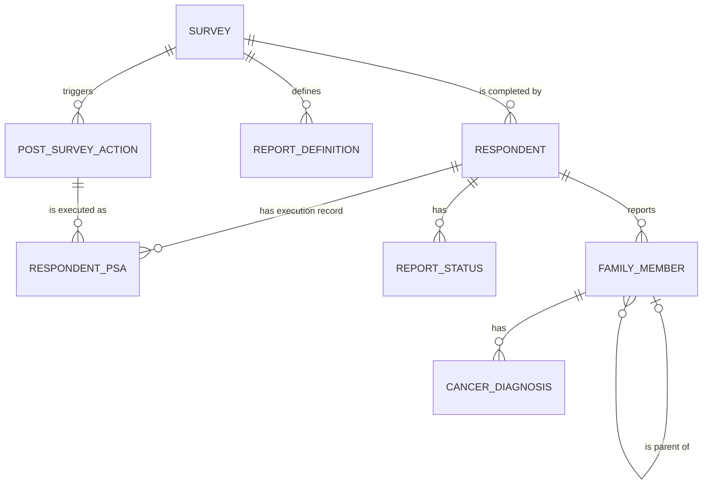

# Entity Model

## Entity Relationship Diagram

### SURVEY

A configured questionnaire (owned by Elicit Survey) that respondents complete; FHHS reads it only to resolve which post-survey actions and report definitions apply.

| Attribute           | Description                                          | Data Type | Length/Precision | Validation Rules      |
|----------------------|-------------------------------------------------------|-----------|-------------------|------------------------|
| id                   | Unique identifier                                     | Long      | 19                | Primary Key, Sequence  |
| displayOrder         | Order surveys are presented in                        | Integer   | 3                 | Not Null               |
| name                 | Internal survey name                                   | String    | 255               | Optional                |
| title                | Respondent-facing survey title                        | String    | 255               | Optional                |
| description          | Description of the survey                              | String    | 500               | Optional                |
| initialDisplayKey    | Display key of the survey's first step                | String    | 255               | Optional                |
| postSurveyURL        | Legacy single post-survey callback URL                 | String    | 255               | Optional                |

### RESPONDENT

An individual who completed (or is completing) a FHHS survey; the subject every FHHS report is generated for.

| Attribute     | Description                                     | Data Type | Length/Precision | Validation Rules                    |
|---------------|--------------------------------------------------|-----------|-------------------|--------------------------------------|
| id            | Unique identifier                                 | Long      | 20                | Primary Key, Sequence                |
| createdDt     | When the respondent record was created            | DateTime  | -                 | Optional                             |
| firstAccessDt | When the respondent first opened the survey        | DateTime  | -                 | Optional                             |
| finalizedDt   | When the respondent finalized (completed) the survey | DateTime | -                | Optional                             |
| active        | Whether the respondent record is active            | Boolean   | 1                 | Not Null                             |
| logins        | Number of times the respondent has logged in        | Integer   | 10                | Not Null                             |
| survey        | Survey this respondent is completing               | Long      | 19                | Not Null, Foreign Key (SURVEY.id)    |
| token         | Access token issued to the respondent              | String    | 255               | Optional                             |

### REPORT_DEFINITION

A report (proband, cancer summary, pedigree, or family history) that a survey makes available once finalized.

| Attribute    | Description                          | Data Type | Length/Precision | Validation Rules                  |
|--------------|----------------------------------------|-----------|-------------------|-------------------------------------|
| id           | Unique identifier                      | Long      | 19                | Primary Key, Sequence               |
| survey       | Survey this report belongs to           | Long      | 19                | Not Null, Foreign Key (SURVEY.id)   |
| name         | Report name                             | String    | 255               | Optional                            |
| description  | Report description                      | String    | 500               | Optional                            |
| url          | Endpoint that generates this report      | String    | 255               | Optional                            |
| displayOrder | Order reports are presented in           | Integer   | 10                | Optional                            |

### POST_SURVEY_ACTION

A configured callback (owned by the Survey application) that fires when a respondent finalizes a survey — this is how Survey tells FHHS to generate a report.

| Attribute      | Description                                 | Data Type | Length/Precision | Validation Rules                  |
|----------------|-----------------------------------------------|-----------|-------------------|-------------------------------------|
| id             | Unique identifier                             | Long      | 19                | Primary Key, Sequence               |
| survey         | Survey this action applies to                  | Long      | 19                | Not Null, Foreign Key (SURVEY.id)   |
| name           | Action name                                    | String    | 255               | Optional                            |
| description    | Action description                             | String    | 500               | Optional                            |
| url            | FHHS endpoint this action calls                 | String    | 255               | Optional                            |
| executionOrder | Order actions run in for a given survey         | Integer   | 10                | Optional                            |

### RESPONDENT_PSA

One attempt (or retry) at executing a `POST_SURVEY_ACTION` for a specific respondent; this is the record the scheduled sweep re-reads to find unfinished work.

| Attribute            | Description                                   | Data Type | Length/Precision | Validation Rules                              |
|-----------------------|------------------------------------------------|-----------|-------------------|-------------------------------------------------|
| id                    | Unique identifier                              | Long      | 20                | Primary Key, Sequence                           |
| respondentId          | Respondent this execution is for                | Long      | 20                | Not Null, Foreign Key (RESPONDENT.id)           |
| psaId                 | Post-survey action being executed               | Long      | 19                | Not Null, Foreign Key (POST_SURVEY_ACTION.id)   |
| tries                 | Number of attempts made so far                  | Long      | 20                | Not Null                                        |
| status                | Current execution status                        | String    | 50                | Not Null, Values: STARTED, FAILED, COMPLETED    |
| error                 | Error message from the most recent failed try    | String    | 1000              | Optional                                        |
| createdDt             | When this execution record was created           | DateTime  | -                 | Not Null                                        |
| uploadedDt            | When the resulting file was uploaded (if any)     | DateTime  | -                 | Optional                                        |

**Constraints:** The scheduled retry sweep only re-attempts rows with `status = 'FAILED'` (a `STARTED` row that never reached `FAILED` or `COMPLETED` is not retried) and stops retrying once `tries` reaches 50.

### REPORT_STATUS

A denormalized view of a respondent's identity, department, and current family-history report status, used by the scheduled retry sweep and the SFTP metadata file — not a domain entity of its own, but the read model FHHS queries to decide what still needs generating.

| Attribute      | Description                                | Data Type | Length/Precision | Validation Rules                    |
|-----------------|---------------------------------------------|-----------|-------------------|---------------------------------------|
| id              | Unique identifier                           | Long      | 20                | Primary Key, Sequence                 |
| respondentId    | Respondent this status is for                | Long      | 20                | Not Null, Foreign Key (RESPONDENT.id) |
| externalId      | Study-assigned external participant ID       | String    | 255               | Optional                              |
| surveyId        | Survey the respondent completed              | Long      | 19                | Not Null, Foreign Key (SURVEY.id)     |
| firstName       | Respondent first name                        | String    | 255               | Optional                              |
| lastName        | Respondent last name                         | String    | 255               | Optional                              |
| middleName      | Respondent middle name                       | String    | 255               | Optional                              |
| dob             | Respondent date of birth                     | Date      | -                 | Optional                              |
| email           | Respondent email address                     | String    | 255               | Optional, Format: Email               |
| phone           | Respondent phone number                      | String    | 50                | Optional                              |
| departmentName  | Study department/site name                   | String    | 255               | Optional                              |
| departmentId    | Study department/site identifier             | String    | 255               | Optional                              |
| token           | Respondent's survey access token             | String    | 255               | Optional                              |
| status          | Current family-history report status         | String    | 50                | Not Null                              |
| createdDt       | When this status row was created             | DateTime  | -                 | Not Null                              |
| finalizedDt     | When the respondent finalized the survey     | DateTime  | -                 | Optional                              |

### FAMILY_MEMBER

One biological relative (or the respondent) whose age/vital status/cancer history was reported — assembled from the respondent's recorded survey answers, not its own database table.

| Attribute        | Description                                        | Data Type | Length/Precision | Validation Rules                        |
|-------------------|------------------------------------------------------|-----------|-------------------|-------------------------------------------|
| id                | Identifier within the respondent's family tree        | Integer   | 10                | Primary Key                              |
| respondentId      | Respondent who reported this family member             | Long      | 20                | Not Null, Foreign Key (RESPONDENT.id)    |
| name              | Display name/label for the family member               | String    | 255               | Optional                                 |
| relationship      | Relationship to the respondent (e.g. sibling, parent)   | String    | 100               | Not Null                                 |
| age               | Current age, or age at death                            | Integer   | 3                 | Optional                                 |
| gender            | Reported gender                                          | String    | 50                | Optional                                 |
| vitalStatus       | Living or deceased                                       | String    | 20                | Not Null, Values: LIVING, DECEASED       |
| sharedParent      | Which parent this member is related through (for halves) | String    | 50                | Optional                                 |
| ashkenaziAncestry | Whether Ashkenazi Jewish ancestry was reported             | Boolean   | 1                 | Optional                                 |
| unknown           | Whether this family member's details are unknown/skipped  | Boolean   | 1                 | Not Null                                 |
| fatherMemberId    | This member's father, within the same family tree         | Integer   | 10                | Optional, Foreign Key (FAMILY_MEMBER.id) |
| motherMemberId    | This member's mother, within the same family tree         | Integer   | 10                | Optional, Foreign Key (FAMILY_MEMBER.id) |

### CANCER_DIAGNOSIS

One reported cancer diagnosis for a family member, including whether it occurred more than once.

| Attribute         | Description                                | Data Type | Length/Precision | Validation Rules       |
|--------------------|-----------------------------------------------|-----------|-------------------|--------------------------|
| id                 | Unique identifier                              | Long      | 19                | Primary Key, Sequence    |
| familyMemberId     | Family member diagnosed                        | Integer   | 10                | Not Null, Foreign Key (FAMILY_MEMBER.id) |
| cancerType         | Type of cancer diagnosed                        | String    | 100               | Not Null                 |
| ageAtDiagnosis     | Age at diagnosis                                | Integer   | 3                 | Optional                 |
| multipleDiagnoses  | Whether this cancer type was diagnosed more than once | Boolean | 1               | Not Null                 |

**Constraints:** `CANCER_DIAGNOSIS.cancerType` is one of the survey's fixed cancer-type vocabulary (bladder, breast, triple-negative breast, colon/rectal, endometrial/uterine, kidney/renal cell, leukemia, lung, lymphoma, melanoma, non-melanoma skin, oral cavity/throat, other, ovarian, pancreatic, prostate, stomach, testicular, thyroid, unknown).
